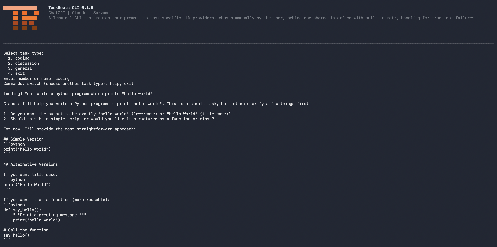
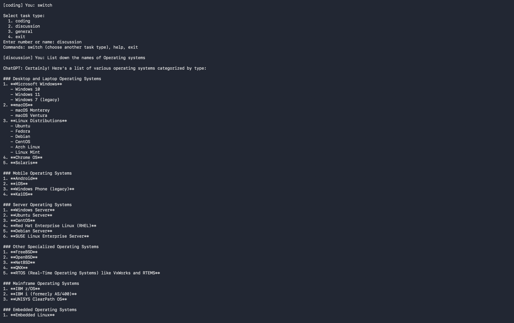
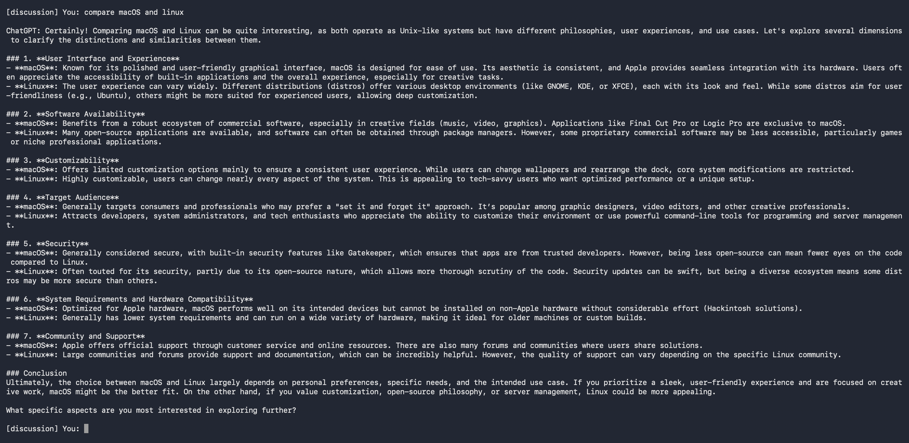
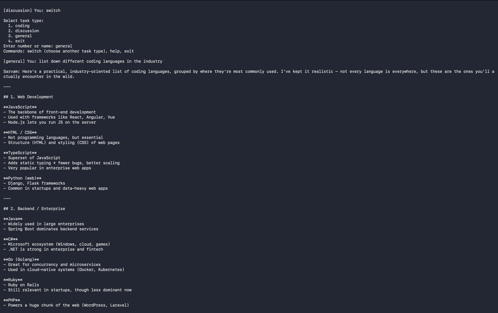
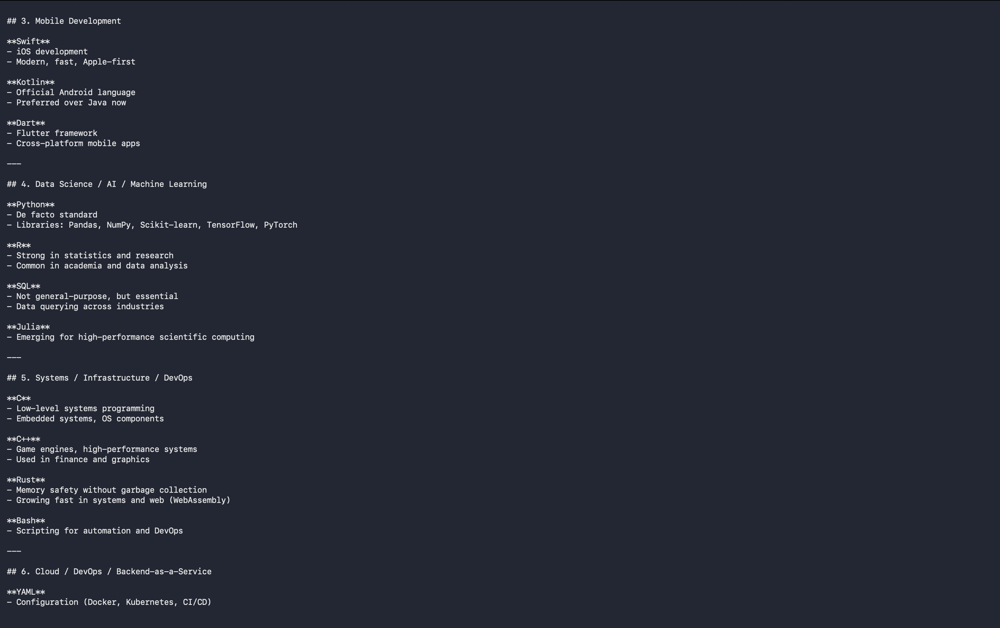

# TaskRouter

<p align="center">
  <pre align="center"><code><span style="color:#FFA07A">██████████████</span>
<span style="color:#FF6600">    ██  ██   ██</span>
<span style="color:#FF7518">    ██  ██████</span>
<span style="color:#B7410E">    ██  ██ ██</span>
<span style="color:#8B3A00">    ██  ██  ██</span></code></pre>
</p>

<p align="center"><strong>A terminal-based multi-provider AI router</strong></p>

TaskRoute gives one terminal interface for three different kinds of work. You choose a task type manually, and TaskRoute sends the prompt to the provider configured for that route.

<p align="center">
  <code>coding → Claude</code> &nbsp;•&nbsp;
  <code>discussion → ChatGPT</code> &nbsp;•&nbsp;
  <code>general → Sarvam AI</code>
</p>

## 1. How does it work :

When the project starts, `brain.py` loads the environment variables. `router.py` then asks you to select `coding`, `discussion`, `general`, or `exit`. Your selection determines which provider adapter handles the prompt: Claude for coding, ChatGPT for discussion, or Sarvam AI for general tasks. The selected adapter applies its system prompt and model configuration, sends the request, and returns the response to the terminal. Retryable provider failures use the shared exponential-backoff logic in `error.py`, while configuration, billing, authentication, and invalid-response failures are reported to the user. The conversation continues until you type `switch` to choose another task, `help` to view commands, or `exit` to close the application. Add terminal screenshots to the sections below.

### Coding — Claude

Use this route for writing, reviewing, debugging, and explaining code.

<!-- Replace the path below with the coding terminal screenshot. -->


### Discussion — ChatGPT

Use this route for exploring ideas, comparing viewpoints, clarifying reasoning, and having a balanced discussion.

<!-- Replace the path below with the discussion terminal screenshot. -->



### General — Sarvam AI

Use this route for general-purpose questions and practical assistance across a wide range of topics.

<!-- Replace the path below with the general terminal screenshot. -->



The task-selection menu is:

```text
Select task type:
  1. coding
  2. discussion
  3. general
  4. exit
Enter number or name:
```

During a session, type `switch` to select another route, `help` to show available commands, or `exit` to close the program.

## 2. Project structure

```text
TaskRouter/
├── .env                      # Local API keys
├── .gitignore                # Keeps .env out of Git
├── README.md                 # Project documentation
├── brain.py                  # Main terminal loop and provider dispatch
├── banner.py                 # Startup banner rendering
├── router.py                 # Task selection and command detection
├── config.py                 # Models, token limits, retries, and timeouts
├── error.py                  # Shared ProviderError and retry/backoff logic
└── Providers/
    ├── __init__.py           # Makes Providers a Python package
    ├── claude.py             # Coding adapter: Claude through OpenRouter
    ├── chatgpt.py            # Discussion adapter: ChatGPT through OpenRouter
    └── sarvamai.py           # General adapter: Sarvam AI
```

### File responsibilities

| File | Responsibility | Important behavior |
|---|---|---|
| [`brain.py`](brain.py) | Runs the interactive application loop. | Loads `.env`, shows the banner once, asks for the task, dispatches prompts, and handles user-facing errors. |
| [`banner.py`](banner.py) | Renders the Rich startup banner. | Contains the logo and startup description; it does not call an AI provider. |
| [`router.py`](router.py) | Handles task selection and control commands. | Valid choices are `coding`, `discussion`, `general`, and `exit`; `switch`, `help`, and `exit` are recognized commands. |
| [`config.py`](config.py) | Centralizes provider configuration. | Stores model IDs, route-specific token limits, retry budgets, backoff values, and request timeout settings. |
| [`error.py`](error.py) | Provides shared error and retry behavior. | Retryable failures use exponential backoff with jitter; other failures become `ProviderError`. |
| [`Providers/claude.py`](Providers/claude.py) | Implements the coding route. | Uses the OpenAI-compatible client with the OpenRouter base URL and Claude model ID. |
| [`Providers/chatgpt.py`](Providers/chatgpt.py) | Implements the discussion route. | Uses the OpenAI-compatible client with the OpenRouter base URL and ChatGPT model ID. |
| [`Providers/sarvamai.py`](Providers/sarvamai.py) | Implements the general route. | Uses the official `sarvamai` SDK and Sarvam model configuration. |

### Current route configuration

| Task | User-facing provider | Backend | Model ID | Output-token limit | Retry budget |
|---|---|---|---|---:|---:|
| Coding | Claude | OpenRouter | `anthropic/claude-sonnet-4` | 1,500 | 5 |
| Discussion | ChatGPT | OpenRouter | `openai/gpt-4o-mini` | 2,000 | 3 |
| General | Sarvam | Sarvam AI | `sarvam-105b` | 2048 | 5 |

The OpenAI-compatible clients use `max_retries=0` so the shared retry implementation in `error.py` is the only retry layer. This prevents duplicate retries and unnecessary delays.

### Error handling

| Error category | Examples | How TaskRoute handles it |
|---|---|---|
| Invalid user input | Empty prompt, invalid task number, unknown command | Prompts the user again with a helpful message. |
| Missing configuration | Missing `OPENROUTER_API_KEY` or `SARVAM_API_KEY` | Raises `ProviderError` and shows a provider-specific configuration error. |
| Authentication or authorization | Invalid API key, unauthorized request | Treated as non-retryable and shown immediately. Check the key and provider account. |
| Insufficient credits | OpenRouter `402`, Sarvam balance/billing failure | Treated as non-retryable. Reduce `max_tokens` or add provider credits. |
| Rate limiting | OpenAI-compatible `RateLimitError`, Sarvam `TooManyRequestsError` | Retried with exponential backoff and jitter up to the route’s retry budget. |
| Provider server failure | OpenAI-compatible 5xx, Sarvam 5xx | Retried with exponential backoff. |
| Network failure | Connection error or request timeout | Retried for the OpenRouter routes; failures are then wrapped as `ProviderError`. |
| Invalid provider response | Missing choices, empty content, unexpected response shape | Raises a clear provider-specific `ProviderError`. |
| Retry exhaustion | All configured retry attempts fail | Shows `Max retries (...) exceeded` and returns control to the terminal loop. |
| User interruption | `Ctrl+C`, `Ctrl+D`, or end-of-file input | Prints `Goodbye!` and exits cleanly. |

HTTP `402` billing/credit errors are not transient network failures, so retrying them will not add credits or fix the request. For OpenRouter, the requested `max_tokens` must fit the remaining account balance.

## 3. Setup and testing

### Before cloning or running

Review the repository and confirm that:

- The repository is the expected project and does not contain suspicious install scripts or commands.
- You will provide your own API keys; never use keys copied from somebody else.
- You have Python 3.10 or newer. The code uses modern type-hint syntax such as `str | None`.
- You understand that API calls may consume credits and that `max_tokens` is an upper output limit, not a guarantee of response length.
- The `.env` file is local and must never be committed or uploaded.
- You are using a virtual environment so project dependencies do not alter your system Python installation.

### Clone the repository

Install Git and Python 3.10 or newer first. Then run the commands for your operating system.

#### macOS

```bash
git clone <repository-url>
cd TaskRouter
python3 --version
python3 -m venv .venv
source .venv/bin/activate
```

#### Windows PowerShell

```powershell
git clone <repository-url>
Set-Location TaskRouter
python --version
python -m venv .venv
.\.venv\Scripts\Activate.ps1
```

#### Windows Command Prompt

```bat
git clone <repository-url>
cd TaskRouter
python --version
python -m venv .venv
.venv\Scripts\activate.bat
```

### Install dependencies

Run this after activating `.venv`.

#### macOS

```bash
python3 -m pip install --upgrade pip
python3 -m pip install 'openai>=1.0.0' 'sarvamai>=0.1.0' 'python-dotenv>=1.0.0' 'rich>=13.0.0'
```

#### Windows PowerShell or Command Prompt

```powershell
python -m pip install --upgrade pip
python -m pip install 'openai>=1.0.0' 'sarvamai>=0.1.0' 'python-dotenv>=1.0.0' 'rich>=13.0.0'
```

The dependencies are:

| Package | Purpose |
|---|---|
| `openai` | OpenAI-compatible client used to call OpenRouter. |
| `sarvamai` | Official Sarvam AI Python SDK. |
| `python-dotenv` | Loads local environment variables from `.env`. |
| `rich` | Renders the colored terminal banner. |

### Configure API keys

Create a file named `.env` in the `TaskRouter` project root. You can create it from Finder/File Explorer, VS Code, or the terminal.

macOS:

```bash
touch .env
nano .env
```

Windows PowerShell:

```powershell
New-Item .env -ItemType File
```

Windows Command Prompt:

```bat
type nul > .env
```

Add your own keys:

```env
OPENROUTER_API_KEY=your_openrouter_api_key
SARVAM_API_KEY=your_sarvam_api_key
```

Do not add quotation marks unless your key specifically requires them. Do not add spaces around `=`. Do not paste keys into Python source files.

### Run the application from a terminal

**These are the everyday commands** — only needed after you've completed one-time setup above (clone, venv creation, `pip install`, `.env` configuration). Once that's done, this is all you run each time you want to use TaskRouter.

⚠️ **Prerequisite:** Complete the "Configure API keys" section above before running the application.

#### macOS

```bash
cd TaskRouter
source .venv/bin/activate
python3 brain.py
```

#### Windows PowerShell

```powershell
.\.venv\Scripts\Activate.ps1
python brain.py
```

#### Windows Command Prompt

```bat
.venv\Scripts\activate.bat
python brain.py
```

The application starts with the banner, displays the task-selection menu, and then waits for a prompt. To stop it, choose `exit` or press `Ctrl+C`.

### Run it in VS Code

1. Open the `TaskRouter` folder in VS Code.
2. Install the official Python extension from Microsoft.
3. Open the Command Palette with `Cmd+Shift+P` on macOS or `Ctrl+Shift+P` on Windows.
4. Choose **Python: Select Interpreter** and select the interpreter inside `.venv`:
   - macOS: `.venv/bin/python`
   - Windows: `.venv\Scripts\python.exe`
5. Open **Terminal → New Terminal**. VS Code should activate the selected environment automatically.
6. If it does not, activate it manually using the commands above.
7. Run `python3 brain.py` on macOS or `python brain.py` on Windows.

Keep `.env` in the project root beside `brain.py`; do not place it inside `.venv` or `Providers`.

### Test the project safely

First verify syntax without making API calls:

macOS:

```bash
python3 -m py_compile brain.py banner.py router.py config.py error.py \
  Providers/claude.py Providers/chatgpt.py Providers/sarvamai.py
```

Windows PowerShell or Command Prompt:

```powershell
python -m py_compile brain.py banner.py router.py config.py error.py Providers/claude.py Providers/chatgpt.py Providers/sarvamai.py
```

Then test each route with a small prompt to limit token usage:

```text
coding: Write a Python function that adds two numbers.
discussion: What are the advantages of modular software design?
general: Give me three facts about India.
```
